# SadGirlPlayer — Architecture

> Internal reference for the AI chatbot pipeline, memory systems, and supporting infrastructure.

---

## High-Level System Overview

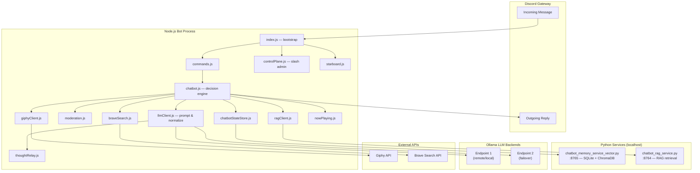

---

## AI Message Lifecycle

The full journey of a single Discord message through the AI pipeline:

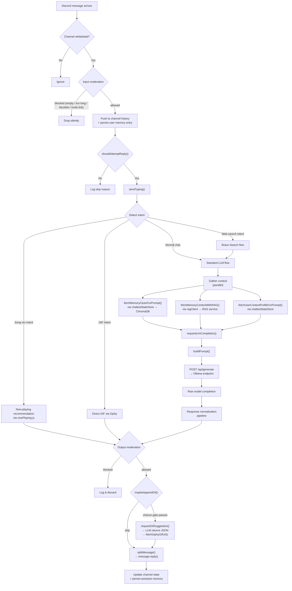

---

## Reply Decision Engine

How `shouldAttemptReply()` decides whether Lumi speaks:

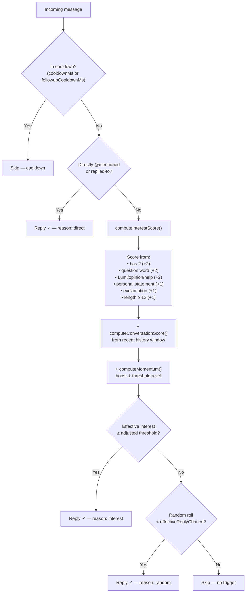

---

## Prompt Assembly

How `buildPrompt()` constructs the final prompt string sent to Ollama:

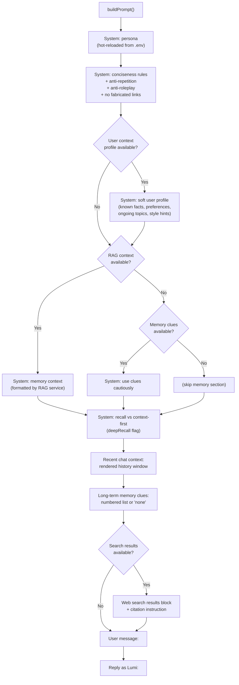

---

## Response Normalization Pipeline

The multi-stage sanitization chain inside `normalizeResponse()`:

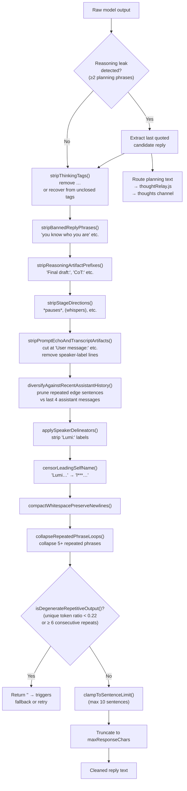

---

## Memory & RAG Architecture

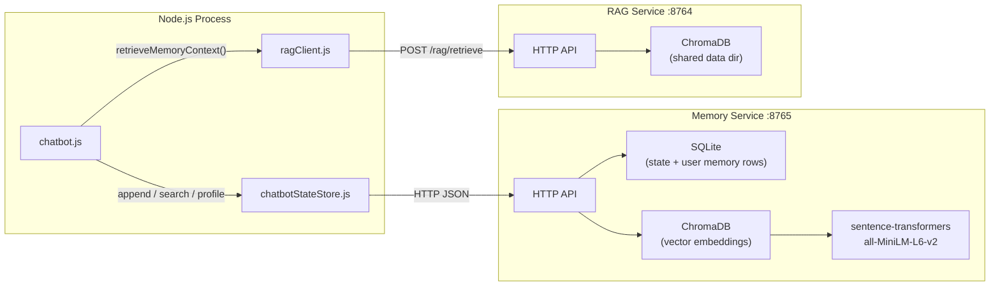

### Memory Write Path

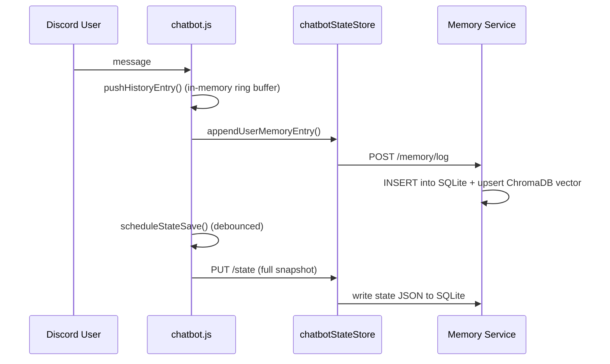

### Memory Read Path (per reply)

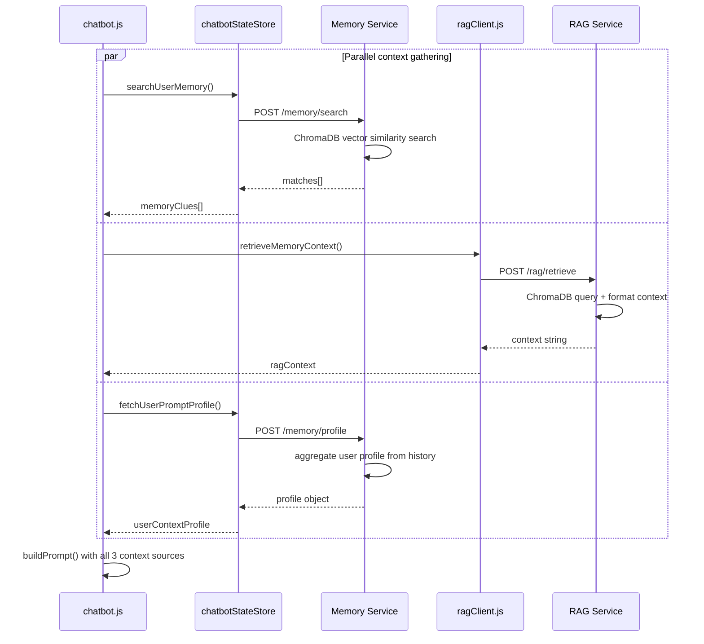

---

## LLM Endpoint Strategy

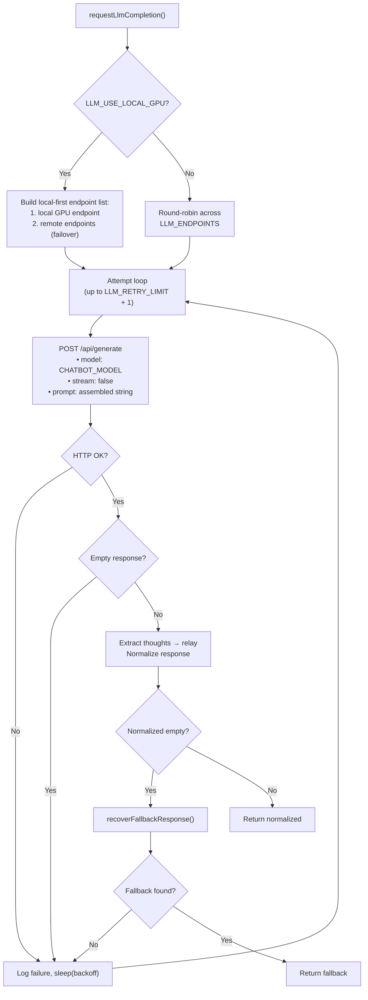

---

## GIF Attachment Pipeline

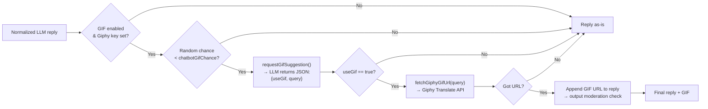

---

## Web Search Flow

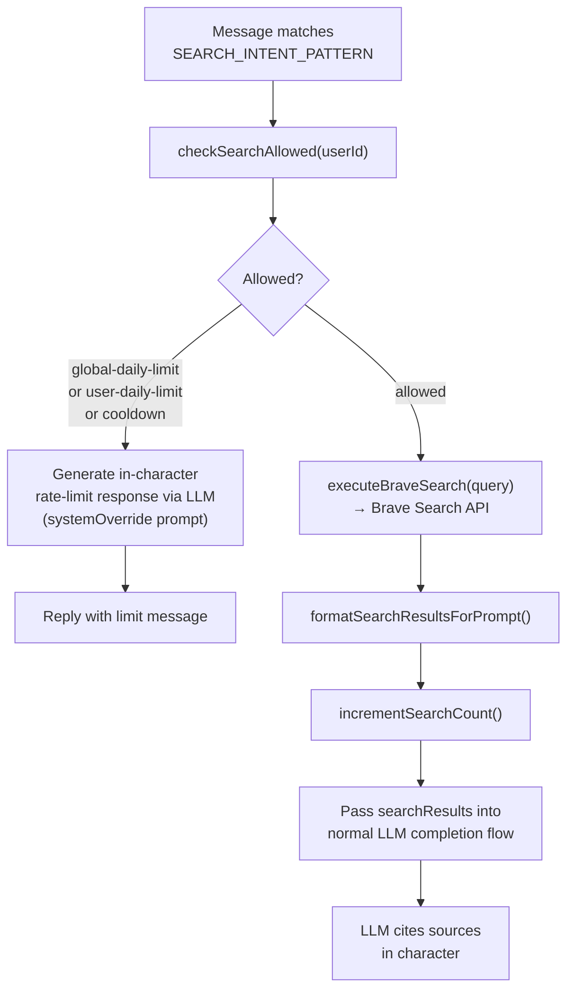

---

## Thought Relay System

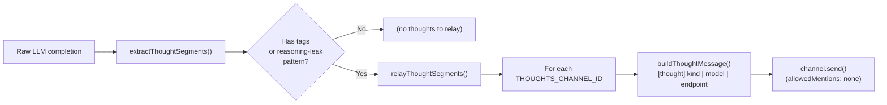

---

## Audio & Voice Pipeline (overview)

```mermaid
flowchart TD
    A["sb!play <input>"] --> B{"Input type?"}
    B -- "YouTube URL" --> C["yt-dlp → extract audio URL"]
    B -- "SoundCloud URL" --> C
    B -- "search terms" --> D["YouTube search\n→ first result"] --> C
    B -- "HTTP/HLS stream" --> E["Direct stream URL"]
    B -- "no arg" --> F["DEFAULT_STREAM_URL"]

    C --> G["FFmpeg → Opus transcode\n(128 kbps)"]
    E --> G
    F --> G

    G --> H["Discord voice connection\nvia @discordjs/voice"]
    H --> I["AudioPlayer → voice channel"]

    I --> J{"Queue empty?"}
    J -- No --> K["Next track → C/E"]
    J -- "Yes + default stream" --> F
    J -- "Yes, no default" --> L["Disconnect"]
```

---

## Service Lifecycle

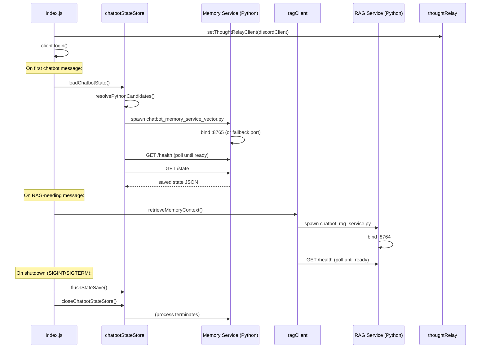

---

## File Responsibility Map

| File | Role |
|------|------|
| `src/index.js` | Bootstrap, Discord client, event routing, graceful shutdown |
| `src/chatbot.js` | Message handling, reply decision engine, intent detection, context orchestration |
| `src/llmClient.js` | Prompt building, Ollama API calls, response normalization pipeline, GIF suggestion |
| `src/chatbotStateStore.js` | Python memory-service lifecycle, HTTP bridge to memory/vector DB |
| `src/ragClient.js` | Python RAG-service lifecycle, HTTP bridge to RAG retrieval |
| `src/thoughtRelay.js` | Routes extracted `<think>` / leaked reasoning text to Discord thoughts channel |
| `src/moderation.js` | Input/output filtering (length, blocklist, mentions, invite links) |
| `src/braveSearch.js` | Brave Search API wrapper, rate limiting (global + per-user + cooldown) |
| `src/giphyClient.js` | Giphy Translate API wrapper |
| `src/controlPlane.js` | Slash-command admin UI (`/lumi-status`, `/lumi-set`, `/lumi-toggle`, etc.) |
| `src/config.js` | Environment variable parsing, runtime config object, persona hot-reload |
| `src/nowPlaying.js` | Polls external song-info URL for now-playing context |
| `src/voice.js` | Discord voice connections, FFmpeg/yt-dlp audio pipeline |
| `src/queue.js` | Per-guild track queue management |
| `src/commands.js` | Prefix command handler (`sb!play`, `sb!stop`, etc.) + slash interaction routing |
| `src/starboard.js` | Reaction-based message reposting |
| `src/welcome.js` | New-member greeting |
| `python/chatbot_memory_service_vector.py` | SQLite state + ChromaDB vector memory HTTP service |
| `python/chatbot_rag_service.py` | RAG retrieval HTTP service over ChromaDB |
